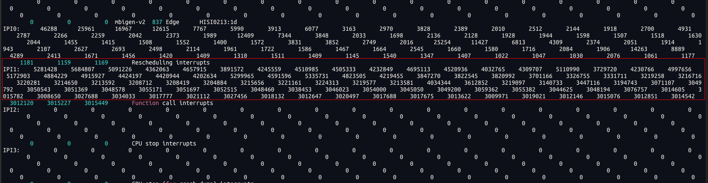

## 遗留问题
- TLB和页表的关系？
- perf record 和 perf report的使用 (加不加-g参数的差异) : 如何查看调用关系
- 

## uptime 平均负载解释

system load averages for the past 1, 5, and 15 minutes. 
（指单位时间内，系统处于可运行状态和不可中断状态的平均进程数。
**当执行stress -c 48后，load average会变成48左右**

> 平均负载的值如果超过逻辑cpu核数的70%， 一般是认为系统负载较高的
- 可运行状态：正在使用cpu或正在等待cpu的状态
- 不可中断状态：处于内核态关键流程中，比如等待硬件设备的I/O响应等


```shell
# uptime
 11:28:09 up 3 days,  8:24,  2 users,  load average: 47.99, 47.99, 48.00
```

### 平均负载相关命令（主要跟CPU相关）
```shell
[root@hostname-zb9ta ~]# watch -d uptime  # -d表示高亮变化的数值 （uptime会一只执行）
[root@hostname-zb9ta ~]# mpstat -P ALL 5 1 # 监控所有cpu，间隔5秒输出一次
Average:     CPU    %usr   %nice    %sys %iowait    %irq   %soft  %steal  %guest  %gnice   %idle
Average:     all    0.00    0.00    0.00    0.00    0.00    0.00    0.00    0.00    0.00  100.00
Average:       0    0.00    0.00    0.00    0.00    0.00    0.00    0.00    0.00    0.00  100.00
Average:       1    0.00    0.00    0.00    0.00    0.00    0.00    0.00    0.00    0.00  100.00
Average:       2    0.00    0.00    0.20    0.00    0.00    0.00    0.00    0.00    0.00   99.80
Average:       3    0.00    0.00    0.00    0.00    0.00    0.00    0.00    0.00    0.00  100.00

[root@hostname-zb9ta ~]# mpstat -P 0-2    # 监控0-2 的cpu core

[root@hostname-zb9ta ~]# pidstat -u 5 1   # 间隔5秒后输出一组数据
# pidstat 的 %wait不是iowait，而是进程等待cpu的时间
Average:      UID       PID    %usr %system  %guest   %wait    %CPU   CPU  Command
Average:        0     45491   41.94    0.00    0.00   57.09   41.94     -  stress
```

## 上下文切换
就是上一个任务的CPU上下文（寄存器和程序计数器）保存，然后加载新任务的上下文的寄存器和程序计数器的过程

- 进程上下文切换
- 线程上下文切换
- 中断上下文切换

### 查询上下文切换相关命令
```shell
[root@hostname-zb9ta ~]# vmstat -w 5
# cs (context switch) 上下文切换次数
# in 每秒中断次数
# r （正在运行的和等待CPU的进程数）

# 使用了stress -c 200
--procs-- -----------------------memory---------------------- ---swap-- -----io---- -system-- ----------cpu----------
   r    b         swpd         free         buff        cache   si   so    bi    bo   in   cs  us  sy  id  wa  st  gu
   1    0            0    258866464       110152      1967500    0    0     6     1    5    5   1   0  99   0   0   0
   1    0            0    258866608       110152      1967500    0    0     0     3  192  322   0   0 100   0   0   0
   1    0            0    258866608       110152      1967500    0    0     0     0  175  313   0   0 100   0   0   0
   1    0            0    258866608       110152      1967500    0    0     0     0  204  356   0   0 100   0   0   0
  38    0            0    258850384       110152      1967500    0    0     0     0  327  417   0   0 100   0   0   0
 201    0            0    258859232       110152      1967500    0    0     0     0 23478 4423  97   0   3   0   0   0
 201    0            0    258860704       110152      1967500    0    0     0     0 24155 5805 100   0   0   0   0   0
 201    0            0    258862912       110152      1967500    0    0     0     0 24218 6335 100   0   0   0   0   0
 201    0            0    258863056       110152      1967500    0    0     0     0 24138 6172 100   0   0   0   0   0
 201    0            0    258864368       110152      1967500    0    0     0     0 24158 6259 100   0   0   0   0   0

[root@hostname-zb9ta ~]# pidstat -w 5
# 自愿上下文切换 ： 因为内存或者I/O等资源不足，主动进行上下文切换
# 非自愿上下文切换 ： 因为时间片已到被系统进行强制调度（当大量进程争抢CPU时，就很高；比如下方的28.32就是用stress -c 200）
Linux 5.10.0-216.0.0.115.oe2203sp4.aarch64 (hostname-zb9ta.foreman.pxe)         01/03/2025      _aarch64_       (96 CPU)

Average:      UID       PID   cswch/s nvcswch/s  Command
Average:        0     61755      1.56      0.00  kworker/u193:0-hclge
Average:        0     65381      1.56      0.00  kworker/u195:1-hclge
Average:        0     65952      1.17      0.00  kworker/u193:1-flush-253:0
Average:        0     65996      0.00     28.32  stress
Average:        0     65997      0.00     29.88  stress
Average:        0     65998      0.00     31.25  stress

[root@hostname-zb9ta ~]# pidstat -wt 1 
# -t 可以记录线程的上下文切换；不加-t的话，只记录进程的上下文切换
```

## 中断类型
```shell
[root@hostname-zb9ta ~]# cat /proc/interrupts 
# 可以看到Rescheduling interrupts 较多
# 主要是因为重调度中断，需要唤醒空闲的cpu来调度新的任务运行（分散任务到不同的cpu上）

```



## CPU 使用率查看
```shell
[root@hostname-zb9ta ~]# pidstat -u 5 1 
[root@hostname-zb9ta ~]# top
```

### CPU 使用率过高的定位方法
#### 简单应用的使用率过高问题排查
1. perf top 查看热点函数
```shell
perf top -g -p 21515 # -p 可以指定进程
```
2. perf record 和 perf report的使用 (加不加-g参数的差异)
```shell
[root@hostname-zb9ta ~]#  perf record # 进行采样
^C[ perf record: Woken up 1 times to write data ]
[ perf record: Captured and wrote 0.324 MB perf.data (1506 samples) ]

[root@hostname-zb9ta ~]# ll
total 420
-rw-------. 1 root root 427980 Jan  7 09:16 perf.data

[root@hostname-zb9ta ~]# perf report  # 展示类似于perf top的报告
```
#### CPU使用率高，但是top找不到对应的进程————短时进程分析
1. top 和 pidstat -u 1 不一定能查询到短时的进程
2. 但是perf record -g 可以记录到； 或者使用 execsnoop（arm上好像没有）
```shell
# pstree 查询进程的父进程，以及进程之间的关系（或者是这个进程是怎么被启动的）
# 数字2 表示有2个进程
[root@hostname-zb9ta ~]# pstree | grep stress
        |-sshd---sshd---sshd-+-bash---stress---2*[stress]
```

#### 系统中大量的不可中断进程和僵尸进程
> top命令下的进程状态
- R （Running / Runnable）
- D （Disk Sleep） 不可中断状态睡眠，一般表示进程正在和硬件交互，切交互过程不允许被其他进程或中断打断
- Z （Zombie） 进程已经结束，但是父进程还没有回收它的资源
- S （Interruptible Sleep） 可中断状态睡眠，表示进程因为等待某个事件而被系统挂起。
- I （Idle）

> 额外的两个进程状态

- T （Stopped/Traced） 暂停（比如发送个一个SIGSTOP信号给进程）或者跟踪状态（gdb调试的时候）：
- X （Dead） 进程已经消亡，无法在top中查看

