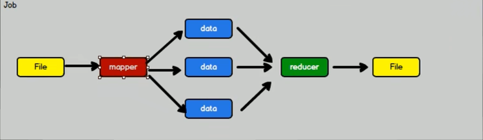
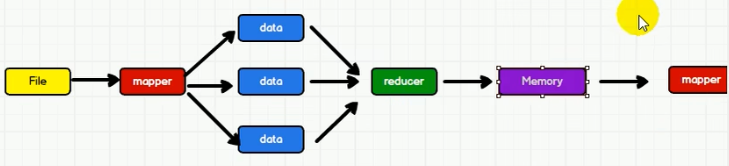

## 什么是Spark
一种基于内存的快速、通用、可扩展的大数据分析计算引擎

## 一次性数据计算
Hadoop是一次性数据计算， 其在处理数据的时侯，会从**存储设备**中读取数据，进行逻辑操作，然后将处理的结果重新存储到**存储设备**中。

而Spark则是将数据从存储设备获取后，存到内存中，以供下个Job的使用

> Spark和Hadoop的根本差异是多个作业之间的数据通信问题：Spark多个作业之间数据
通信是基于内存，而Hadoop是基于磁盘。

