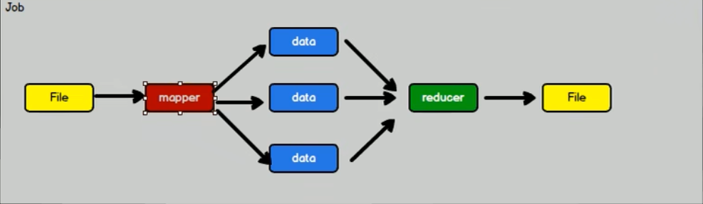
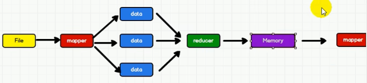
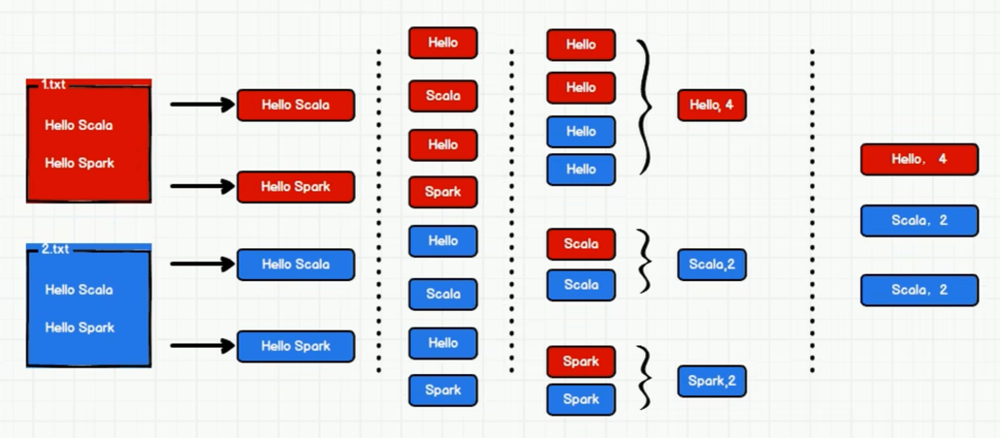
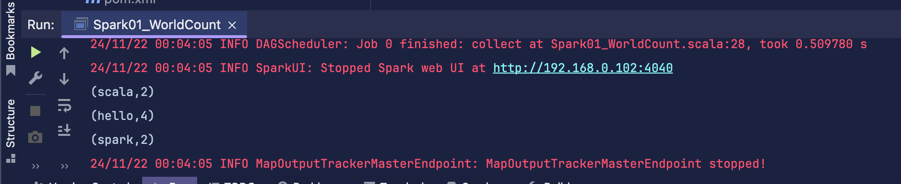
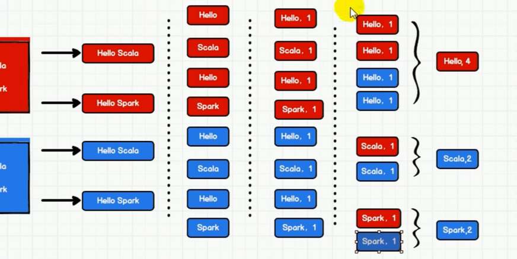

## 什么是Spark
一种基于内存的快速、通用、可扩展的大数据分析计算引擎

## 一次性数据计算
Hadoop是一次性数据计算， 其在处理数据的时侯，会从**存储设备**中读取数据，进行逻辑操作，然后将处理的结果重新存储到**存储设备**中。


而Spark则是将数据从存储设备获取后，存到内存中，以供下个Job的使用


> Spark和Hadoop的根本差异是多个作业之间的数据通信问题：Spark多个作业之间数据
通信是基于内存，而Hadoop是基于磁盘。

## word—count

### 方式1

```scala
package wc

import org.apache.spark.rdd.RDD
import org.apache.spark.{SparkConf, SparkContext}

object Spark01_WorldCount {
  def main(args: Array[String]): Unit = {
    // 建立和Spark框架的连接
    val sparkConf = new SparkConf().setMaster("local").setAppName("WordCount")
    val sc = new SparkContext(sparkConf)

    // 业务操作

    // 1. 读取文件， 获取一行行数据
    val lines : RDD[String] = sc.textFile("data")

    // 2. 将一行行数据拆分， 形成一个个单词 (扁平化)
    val words : RDD[String] = lines.flatMap(_.split(" "))
    // 3. 将单词进行分组，便于统计
    val wordGroup : RDD[(String, Iterable[String])] = words.groupBy(word => word)
    // 4. 统计各个分组的数量
    var wordCount = wordGroup.map {
      case ( word, list) => {
        (word, list.size)
      }
    }
    // 5. 输出
    val tuples = wordCount.collect()
    tuples.foreach(println)
    
    // 关闭连接
    sc.stop()
  }
}
```

**output:**


### 方式2

```scala
package wc

import org.apache.spark.rdd.RDD
import org.apache.spark.{SparkConf, SparkContext}

object Spark02_WorldCount {
  def main(args: Array[String]): Unit = {
    // 建立和Spark框架的连接
    val sparkConf = new SparkConf().setMaster("local").setAppName("WordCount")
    val sc = new SparkContext(sparkConf)

    // 业务操作

    // 1. 读取文件， 获取一行行数据
    val lines : RDD[String] = sc.textFile("data")

    // 2. 将一行行数据拆分， 形成一个个单词 (扁平化)
    val words : RDD[String] = lines.flatMap(_.split(" "))

    var wordToOne = words.map( word => (word, 1))

    // 可以将3-4步的分组和聚合 合并为一步 ： 
    // wordToOne.reduceByKey((x, y) => x + y)
    
    // 3. 将单词进行分组，便于统计
    val wordGroup: RDD[(String, Iterable[(String, Int)])] = wordToOne.groupBy(t => t._1)
    // 4. 统计各个分组的数量
    var wordCount = wordGroup.map {
      case ( word, list) => {
        list.reduce(
          (t1, t2) => {
            (t1._1, t1._2 + t2._2)
          }
        )
      }
    }
    
    // 5. 输出
    val tuples = wordCount.collect()
    tuples.foreach(println)

    // 关闭连接
    sc.stop()
  }
}
```