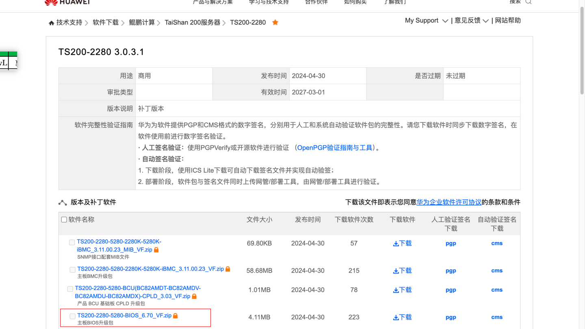
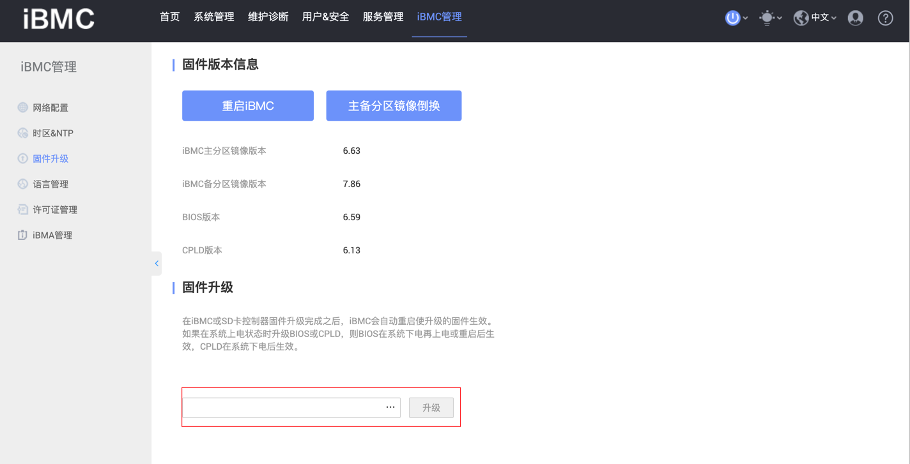
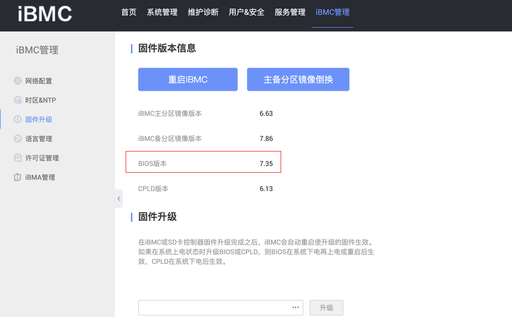

# TaiShan 200 2280设备BIOS升级指南

## 查看当前BIOS版本
```shell
[root@localhost ~]# dmidecode -t bios
# dmidecode 3.2
Getting SMBIOS data from sysfs.
SMBIOS 3.3.0 present.
# SMBIOS implementations newer than version 3.2.0 are not
# fully supported by this version of dmidecode.

Handle 0x0000, DMI type 0, 26 bytes
BIOS Information
        Vendor: Huawei Corp.
        Version: 6.59
        Release Date: 07/18/2023
        Address: 0x5F000
        Runtime Size: 644 kB
        ROM Size: 6144 kB
        Characteristics:
```

## 官网下载BIOS新版本
根据页面 选择 技术支持->软件下载->鲲鹏计算->TaiShan200服务器->TS200-2280 (具体的硬件请根据自己的设备选择)

[support官网](https://support.huawei.com/enterprise/zh/kunpeng-computing/ts200-2280-pid-250697162/software/262565441?idAbsPath=fixnode01%7C23710424%7C251364417%7C9856629%7C250697162)


## 固件升级
打开iBMC管理->固件升级，并导入hpm文件




## 重启设备进行验证


## FAQ
提示无效升级包等其他问题，一般都是BIOS升级包和硬件不匹配等原因，可以下载其他版本进行尝试