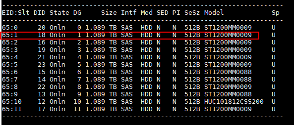

## storcli64安装
1. 下载并解压StorCLI.zip, 并安装Unified_storcli_all_os/ARM/Linux/storcli-007.1507.0000.0000-1.aarch64.rpm

```shell
cd ./Unified_storcli_all_os/ARM/Linux
rpm -ivh storcli-007.1507.0000.0000-1.aarch64.rpm
```

2. storcli64的使用
```shell
/opt/MegaRAID/storcli/storcli64 --help
```

## RAID缓存策略配置
参考： https://www.hikunpeng.com/document/detail/zh/kunpengbds/ecosystemEnable/HBase/kunpenghbasehdp_05_0009_0.html

1. 查询服务器所有的raid卡配置信息
```shell
/opt/MegaRAID/storcli/storcli64 /call show

# Controller = 0 为controllerId， 如果要具体查询某个controllerId对应的卡，可以使用/c0

[root@agent2 Linux]# /opt/MegaRAID/storcli/storcli64 /call show
Generating detailed summary of the adapter, it may take a while to complete.

CLI Version = 007.1507.0000.0000 Sep 18, 2020
Operating system = Linux 4.19.90-2003.4.0.0036.oe1.aarch64
Controller = 0
Status = Success
Description = None
```

2. 查询controllerId=0的卡
```shell
/opt/MegaRAID/storcli/storcli64 /c0 show
```

3. 创建raid0
```shell
# 创建RAID 0，命令表示为第2块1.2T硬盘创建RAID 0，其中，c0表示RAID控制卡所在ID、r0表示组RAID 0。依次类推，对除了系统盘之外的所有盘做此操作。
./storcli64_arm /c0 add vd r0 drives=65:1

```


4. 查询配置的vd 0信息（我理解应该就是配置的raid的信息）
```shell

Virtual Drives :
==============

---------------------------------------------------------------
DG/VD TYPE  State Access Consist Cache Cac sCC       Size Name 
---------------------------------------------------------------
0/0   RAID0 Optl  RW     Yes     NRWTD -   ON  893.137 GB      
---------------------------------------------------------------
```

5. 判断是否有超级电容: /opt/MegaRAID/storcli/storcli64 /c0/cv show all
> 状态为failure，且没有其他Cachevault_info等信息回显，一般就是没有
```shell
[root@agent2 Linux]# /opt/MegaRAID/storcli/storcli64 /c0/cv show all
CLI Version = 007.1507.0000.0000 Sep 18, 2020
Operating system = Linux 4.19.90-2003.4.0.0036.oe1.aarch64
Controller = 0
Status = Failure
Description = None

Detailed Status :
===============

-------------------------------------------------
Ctrl Status Property ErrMsg                ErrCd 
-------------------------------------------------
   0 Failed -        Cachevault is absent!    34 
-------------------------------------------------

```

6. 配置缓存策略
```shell
/opt/MegaRAID/storcli/storcli64 /c0/v0 set rdcache=RA
/opt/MegaRAID/storcli/storcli64 /c0/v0 set wrcache=WB/AWB
/opt/MegaRAID/storcli/storcli64 /c0/v0 set iopolicy=Cached
```


```
JBOD 顺序读:
fio -filename=/dev/sde -direct=1 -iodepth 1 -thread -rw=read -ioengine=psync -bs=16k -size=2G -numjobs=10 -runtime=300 -group_reporting -name=mytest
    # 磁盘中没有任何数据：
    read: IOPS=24.7k, BW=386MiB/s 
    read: IOPS=28.4k, BW=445MiB/s
    read: IOPS=27.6k, BW=431MiB/s
    # 磁盘中有数据：1个400MB左右的视频文件
    read: IOPS=27.4k, BW=429MiB/s
    read: IOPS=26.4k, BW=413MiB/s
    read: IOPS=27.0k, BW=437MiB/s
    # 磁盘中有数据： 3个400MB左右的视频文件
    read: IOPS=23.6k, BW=369MiB/s
    read: IOPS=24.3k, BW=380MiB/s
    read: IOPS=27.3k, BW=426MiB/s
    read: IOPS=25.6k, BW=401MiB/s
    
    # 磁盘中有多个文件 8.5GB
    read: IOPS=20.6k, BW=323MiB/s
    read: IOPS=27.7k, BW=433MiB/s
    read: IOPS=23.2k, BW=363MiB/s
    read: IOPS=29.0k, BW=453MiB/s
    read: IOPS=26.8k, BW=419MiB/s
    
    

JBOD 随机读:
fio -filename=/dev/sde -direct=1 -iodepth 1 -thread -rw=randread -ioengine=psync -bs=16k -size=2G -numjobs=10 -runtime=60 -group_reporting -name=mytest
    # 磁盘中没有任何数据：
    read: IOPS=709, BW=11.1MiB/s 
    read: IOPS=708, BW=11.1MiB/s 
    read: IOPS=709, BW=11.1MiB/s
    
    # 磁盘中有多个文件 8.5GB
    read: IOPS=710, BW=11.1MiB/s 
    
JBOD 顺序写:
fio -filename=/dev/sde -direct=1 -iodepth 1 -thread -rw=write -ioengine=psync -bs=16k -size=2G -numjobs=10 -runtime=60 -group_reporting -name=mytest -allow_mounted_write=1
    # 磁盘中有多个文件 8.5GB
    write: IOPS=4291, BW=67.1MiB/s
    write: IOPS=3558, BW=55.6MiB/s
    write: IOPS=5235, BW=81.8MiB/s
    write: IOPS=4656, BW=72.8MiB/s
    write: IOPS=4299, BW=67.2MiB/s
JBOD 随机写：
fio -filename=/dev/sde -direct=1 -iodepth 1 -thread -rw=randwrite -ioengine=psync -bs=16k -size=2G -numjobs=10 -runtime=60 -group_reporting -name=mytest -allow_mounted_write=1
    # 磁盘中有多个文件 8.5GB
    write: IOPS=832, BW=13.0MiB/s
    write: IOPS=805, BW=12.6MiB/s
    write: IOPS=799, BW=12.5MiB/s


单盘RAID0 顺序读:
    
单盘RAID0 随机读:
    
单盘RAID0 顺序写:
    
单盘RAID0 随机写:
    

```

----
## linux系统中如何删除lvm分区
https://blog.csdn.net/m0_37253968/article/details/110440911
1. lvdisplay 查询到的LV Path用于后面的解除挂载
```shell
 --- Logical volume ---
  LV Path                /dev/openeuler_hostname43b8h/home
  LV Name                home
  VG Name                openeuler_hostname43b8h
  LV UUID                lzsRw2-ZNs6-omqW-eg33-v7Zq-ZRqZ-2xldSW
  LV Write Access        read/write
  LV Creation host, time hostname43b8h.foreman.pxe, 2024-11-26 11:56:19 +0000
  LV Status              available
  # open                 1
  LV Size                <5.19 TiB
  Current LE             1359434
  Segments               5
  Allocation             inherit
  Read ahead sectors     auto
  - currently set to     8192
  Block device           253:2
```
2. umount /dev/openeuler_hostname43b8h/home
3. 再删除逻辑卷，删除语法：lvremove  逻辑卷名，删除完成后再查看逻辑卷发现已经删除完成了
```shell
[root@hostname43b8h /]# lvremove /dev/openeuler_hostname43b8h/home
Do you really want to remove active logical volume openeuler_hostname43b8h/home? [y/n]: y
  Logical volume "home" successfully removed
  
[root@hostname43b8h /]# lvdisplay  
# /dev/openeuler_hostname43b8h/home 逻辑卷已删除
```
## 删除磁盘分区
1. lsblk
```shell
[root@hostname43b8h /]# lsblk 
NAME                             MAJ:MIN RM   SIZE RO TYPE MOUNTPOINT
sda                                8:0    0   1.1T  0 disk 
├─sda1                             8:1    0   200M  0 part /boot/efi
├─sda2                             8:2    0     1G  0 part /boot
└─sda3                             8:3    0   1.1T  0 part 
  └─openeuler_hostname43b8h-swap 253:1    0     4G  0 lvm  [SWAP]
sdb                                8:16   0   1.1T  0 disk 
└─sdb1                             8:17   0   1.1T  0 part 
sdc                                8:32   0   1.1T  0 disk 
└─sdc1                             8:33   0   1.1T  0 part 
sdd                                8:48   0   1.1T  0 disk 
└─sdd1                             8:49   0   1.1T  0 part 
sde                                8:64   0 894.3G  0 disk 
└─sde1                             8:65   0 894.3G  0 part 
  └─openeuler_hostname43b8h-root 253:0    0    50G  0 lvm  /
```

2. fdisk /dev/sdb
```shell
# 输入d后再敲w保存
```
3. lsblk 验证
```shell
[root@hostname43b8h /]# lsblk 
NAME                             MAJ:MIN RM   SIZE RO TYPE MOUNTPOINT
sda                                8:0    0   1.1T  0 disk 
├─sda1                             8:1    0   200M  0 part /boot/efi
├─sda2                             8:2    0     1G  0 part /boot
└─sda3                             8:3    0   1.1T  0 part 
  └─openeuler_hostname43b8h-swap 253:1    0     4G  0 lvm  [SWAP]
sdb                                8:16   0   1.1T  0 disk 
sdc                                8:32   0   1.1T  0 disk 
sdd                                8:48   0   1.1T  0 disk 
sde                                8:64   0 894.3G  0 disk 
└─sde1                             8:65   0 894.3G  0 part 
  └─openeuler_hostname43b8h-root 253:0    0    50G  0 lvm  /
[root@hostname43b8h /]# 
```
## 格式化磁盘
mkfs.xfs -f /dev/sdb

## fio测试
### JBOD
```shell
JBOD 顺序读:
fio -filename=/dev/sdb -direct=1 -iodepth 1 -thread -rw=read -ioengine=psync -bs=16k -size=2G -numjobs=10 -runtime=300 -group_reporting -name=mytest
  read: IOPS=9182, BW=143MiB/s 
JBOD 随机读:
fio -filename=/dev/sdb -direct=1 -iodepth 1 -thread -rw=randread -ioengine=psync -bs=16k -size=2G -numjobs=10 -runtime=300 -group_reporting -name=mytest
  read: IOPS=185, BW=2961KiB/s
  read: IOPS=647, BW=10.1MiB/s 
JBOD 顺序写:
fio -filename=/dev/sdb -direct=1 -iodepth 1 -thread -rw=write -ioengine=psync -bs=16k -size=2G -numjobs=10 -runtime=300 -group_reporting -name=mytest -allow_mounted_write=1
  write: IOPS=2163, BW=33.8MiB/s
  write: IOPS=2598, BW=40.6MiB/s
JBOD 随机写:
fio -filename=/dev/sdb -direct=1 -iodepth 1 -thread -rw=randwrite -ioengine=psync -bs=16k -size=2G -numjobs=10 -runtime=300 -group_reporting -name=mytest -allow_mounted_write=1
  write: IOPS=723, BW=11.3MiB/s
```

### 单盘RAID0 （SAS3408卡： 无缓存）
```shell
storcli64 /c0/e64/s3 set good force # 需要将磁盘从JBOD状态修改为UGood状态才能组raid0 
storcli64 /c0 add vd r0 drives=64:3 # slot槽位是通过SN序列号定位的lsblk -o NAME,SERIAL和storcli64 /c0/e64/s3 show all命令确定
# 此时lsblk会出现新的盘（也可能和之前的盘名相同）
storcli64 /c0/v0 start init
```


```shell
JBOD 顺序读:
fio -filename=/dev/sdf -direct=1 -iodepth 1 -thread -rw=read -ioengine=psync -bs=16k -size=2G -numjobs=10 -runtime=300 -group_reporting -name=mytest
  read: IOPS=9170, BW=143MiB/s
JBOD 随机读:
fio -filename=/dev/sdf -direct=1 -iodepth 1 -thread -rw=randread -ioengine=psync -bs=16k -size=2G -numjobs=10 -runtime=300 -group_reporting -name=mytest
  read: IOPS=476, BW=7622KiB/s
  read: IOPS=647, BW=10.1MiB/s
JBOD 顺序写:
fio -filename=/dev/sdf -direct=1 -iodepth 1 -thread -rw=write -ioengine=psync -bs=16k -size=2G -numjobs=10 -runtime=300 -group_reporting -name=mytest -allow_mounted_write=1
  write: IOPS=2159, BW=33.7MiB/s
  write: IOPS=2186, BW=34.2MiB/s 
JBOD 随机写:
fio -filename=/dev/sdf -direct=1 -iodepth 1 -thread -rw=randwrite -ioengine=psync -bs=16k -size=2G -numjobs=10 -runtime=300 -group_reporting -name=mytest -allow_mounted_write=1
  write: IOPS=720, BW=11.3MiB/s
  
```


## 华为RAID卡 用户指南
> SAS3408iMR

https://support.huawei.com/enterprise/zh/doc/EDOC1100048779/62aa8740


