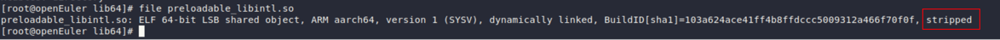

## 动态库的gdb调试指南
> 前提条件： so库的编译加入了-g的编译选项
> 
> [BLOG：如何调试系统库(libcurl)](http://nju04zq.github.io/2015/08/26/%E5%A6%82%E4%BD%95%E8%B0%83%E8%AF%95%E7%B3%BB%E7%BB%9F%E5%BA%93-libcurl/)

1. libcurl库添加编译选项--enable-debug 或者在Makefile中加-g （搜索FLAGS）
```shell
wget https://api.github.com/repos/curl/curl/tarball/curl-7_60_0
tar -zxvf curl-7_60_0
cd curl-curl-7_60_0
./buildconf
./configure --prefix=/usr/local/curl  # 添加--enable-debug即可
# 如果是cmake 也可以像cmake -DCMAKE_BUILD_TYPE=Debug .该命令一样添加-DCMAKE_BUILD_TYPE=Debug
make && make install
```

2. 验证是否成功
```shell
file /use/lib64/libsurl.so 
```
 带有stripped的就是没有带gdb调试项的； 带有not stripped就是有gdb调试项的


3. 验证test程序是否调用了新生成的libsurl.so动态库
```shell
ldd test # 可以查询是否使用了编译后的libcurl.so (其中test为编译后的程序)
```

4. 具体的调试：
```shell
gdb ./test
set args V1 V2 V3 # 配置启动参数
b FileTransfer.cpp:324 # 设置断点
run # 
start # 重头开始好像？
n # 下一行
s # 进入函数
bt # 

b easy.c:640
c
p data->state.infilesize

# 排查data->state.infilesize什么时候赋值或者更改
watch data->state.infilesize
c

```